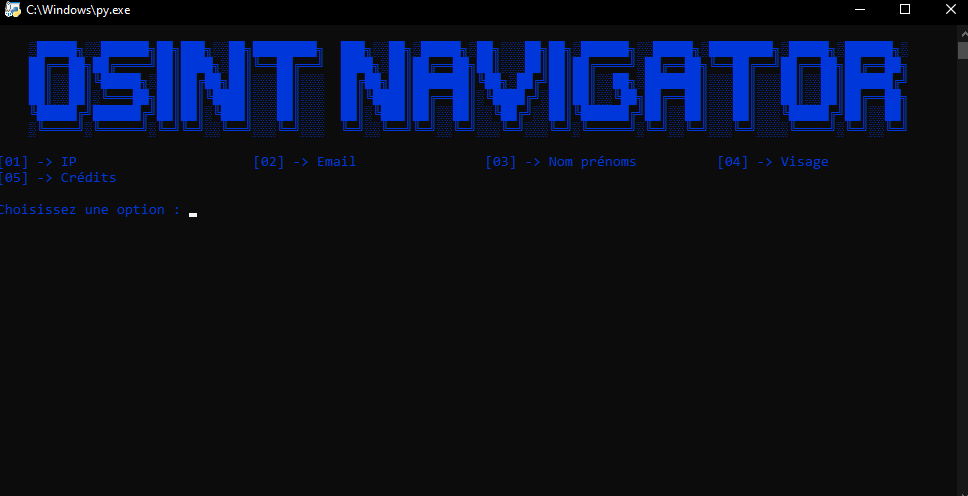

# 🧭 **OSINT Navigator Tool** 🌐

 

**OSINT Navigator Tool** est un outil simple qui permet de rechercher des informations publiques sur Internet en utilisant des sources ouvertes (OSINT).

🔗 **Qu'est-ce que l'OSINT ?**  
L'OSINT (Open Source Intelligence) désigne les informations accessibles à tous sur Internet. Pour en savoir plus, consultez ce lien :  
https://fr.wikipedia.org/wiki/Open_source_intelligence

---

## 🚀 **Fonctionnalités principales** :

Voici les catégories disponibles pour rechercher des informations :

- **[01]** → 🖥️ **IP**
- **[02]** → 📧 **Email**
- **[03]** → 👤 **Nom & Prénom**
- **[04]** → 👁️ **Visage**
- **[05]** → 💳 **Crédits**

---

## 📊 **Utilisation** :

1. Lancez l'outil.
2. Choisissez une catégorie (par exemple, IP, Email, etc.).
3. L'outil vous redirigera vers les sites associés pour effectuer vos recherches.
4. Refaites un choix pour explorer d'autres catégories ou revenir au menu.

---

## 💬 **Informations de développement** :

- **Développeur** : blax_dev
- **Version** : 1.2
- **Discord** : [Rejoindre le serveur Discord](https://discord.gg/backgen)
- **SiteWeb** : [Backgen.com](https://backgen.onrender.com/)
